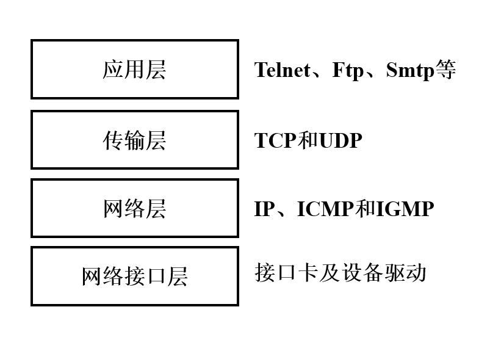
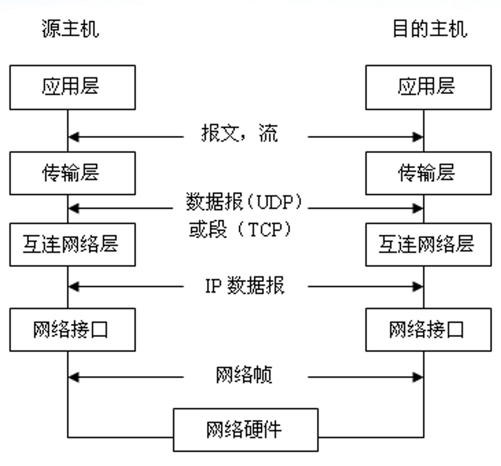
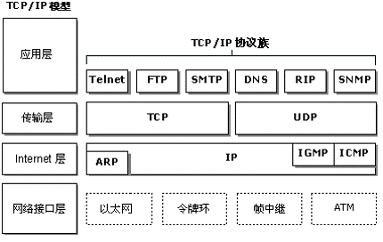

# 计算机网络概要

## 计算机网络的概念

一般认为，计算机网络是一个将分散的，具有独立功能的计算机系统，通过通信设备与线路连接起来，由功能完整的软件实现资源共享和信息传递的系统。

## 计算机网络的组成

从组成部分上看，一个完整的计算机网络主要由硬件、软件、协议三大组成部分，缺一不可。

从工作方式上看，计算机网络（主要指Internet）可分为边缘部分和核心部分。

从功能组成上看，计算机网络由通信子网和资源子网组成。

## 计算机网络的功能

- 数据通信
- 资源共享
- 分布式处理
- 提高可靠性
- 负载均衡

## 计算机网络的分类

### 按分布范围分类

- 广域网（WAN）
- 城域网（MAN）
- 局域网（LAN）
- 个人局域网（PAN）

### 按传输技术分类

- 广播式网络
- 点对点式网络

### 按拓扑结构分

- 星形网络
- 总线形网络
- 环形网络
- 网状形网络

### 按使用者分

- 公用网
- 专用网

### 按交换技术分类

- 电路交换网络
- 报文交换网络
- 分组交换网络

## TCP/IP简介

TCP/IP协议源于1969年，是针对Internet开发的一种体系结构和协议标准，其目的在于解决异种计算机网络的通信问题。

TCP/IP的全称是Transmission Control Protocol/Internet Protocol，中译名为传输控制协议/因特网互联协议，又名网络通讯协议，是Internet（注意和Intranet相区分，Intranet是局域网，而Internet目前泛指国际互联网）最基本的协议。

TCP/IP定义了电子设备如何连入因特网，以及数据如何在它们之间传输的标准。协议采用了4层的层级结构，每一层都呼叫它的下一层所提供的协议来完成自己的需求。

这样的设计使得网络在互联时能为用户提供一种通用、一致的通信服务，现在同时也是国际互联网Internet采用的协议标准。

TCP/IP是一组通信协议的代名词，是由一系列协议组成的协议簇，它本身指两个协议集：

- TCP 传输控制协议
- IP 互联网络协议

其组成如下如所示：

当数据在网路中传输的时候，会依次进过每一层，最终呈现给用户。

## TCP/IP模型

由于TCP/IP模型已经成为了事实上的互联网标准，所以我们将不再赘述ISO/OSI七层参考模型（因为基本用不到，除了考试）。

从上至下依次是应用层、传输层、网络层、网络接口层，其中网络接口层也可以继续分为数据链路层和物理层（我们在计算机和网络安全的相关工作学习中，基本上只会用到数据链路层以上的区域，所以这里我们将不对物理层做过多的介绍。

## 数据链路层

在数据链路层上，我们把数据单元称为帧，所以在这一层，我们主要关注的有这么几个内容：

- 封装成帧
- 透明传输
- 差错控制

其中主要关系到网络空间安全的是差错控制，，其中差错控制也可以分为两类：

- 检错编码
- 纠错编码

通俗来讲，检错编码只要求接收方在接受的时候，能验证数据的正确性，如果在传输过程中发生错误，接收方将无法进行正确数据的还原，只能设法通知发送方重新发送，或者直接丢弃错误数据。

比较著名的检错编码有**奇偶检验码**、**循环冗余码**。

奇偶检验码好理解，在整个数据里面，校验位只有一位，当使用的是奇检验的时候，整个数据包括校验位里面1的个数一定为奇数个。而如果使用的是偶检验，整个数据包括检验位里面1的个数一定为偶数个。

循环冗余码则比奇偶检验码稍微复杂那么一点，假设我们要发送一个m bit的帧，发送器会自动生成r bit的**帧检验序列**（FCS），之后将这两个数据一前一后组合在一起发送出去。接收方接受到数据之后，使用和发送方提前协商好的一个多项式G(x)，让数据除以这个多项式G(x)，如果能整除，数据是正确的，具体计算FCS的过程可以参考计算机网络相关书籍。

而纠错编码则需要接受方接受到数据之后，能通过数据中的信息自动完成错误数据的检测和纠错。

## 网络层

网络层主要负责在主机之间寻址和选择数据包的路由，IP协议不含错误恢复的编码，属于不可靠的协议。

在这里中，我们要知道的有这么三个协议：

- ARP协议
- DHCP协议
- ICMP协议

### ARP协议

IP地址是网络层使用的地址，硬件地址是数据链路层使用的地址，在实际网络的链路上传输，最终必须要使用硬件地址，所以这里就需要一个IP地址和硬件MAC地址的映射关系，这就是**地址解析协议**（Address Resolution Protocol），在每个主机里面都有一个ARP高速缓存，存放局域网上各主机和路由器的IP地址到MAC地址的映射表，称ARP表，这个表就是使用ARP协议来维护的。

当主机A欲向本局域网里面的主机B发送IP数据报时，就现在其ARP高速缓存中查看有无主机B的IP地址，如有，就可以查出主机B的MAC地址，在将其MAC地址写入MAC帧，最后通过局域网将此MAC帧发送出去。

当ARP高速缓存里面没有主机B的MAC地址，就通过使用目的MAC地址为FF-FF-FF-FF-FF-FF的帧来封装并广播ARP请求分组，在局域网内的各台主机都能收到此ARP请求。当主机B收到这个广播的时候，就会向主机A发送ARP响应分组，分组中包含了主机B的IP和MAC地址映射表，主机A在收到此映射表之后将此映射表写入ARP缓存，然后按查询到的MAC地址发送MAC帧。
 
### DHCP协议

**动态主机配置协议**（Dynamic Host Configuration Protocol）常用于给主机动态地分配IP地址，它提供了即插即用联网机制。DHCP是应用层协议，基于UDP。

DHCP协议使用客户/服务器方式工作，需要IP地址的主机在启动时就向DHCP服务器广播发送报文，这时主机就成为了DHCP客户，本地网络上所有主机都能收到此报文，但是只有DHCP服务器才会回答此广播报文，DHCP服务器首先在自己数据库里面找该主机的配置信息，如找到，则返回找到的信息，如找不到，就从服务器的IP地址池中去一个地址分配给该主机。

### ICMP协议

为了提高IP数据报交付成功的机会，在网络层中使用了**网际控制报文协议**（Internet Control Message Protocol），来允许主机或路由器报告差错和异常情况。ICMP是网络层的协议。

ICMP常见的两个应用是分组网间探测PING，用来测试两个主机之间的连通性，还有traceroute，用来追踪分组经过的路由器。其中PING使用了ICMP的回送请求和回答报文，traceroute使用了ICMP的时间超过报文。

## 传输层

从通信和信息处理的角度来说，传输层向它上面的应用层提供通信服务，它属于面向通信部分的最高层，同时也是用户功能中的最低层。

传输层位于网络层之上，它为运行在不同主机上的进程之间提供逻辑通信，网络层则是为主机之间提供逻辑通信。

传输层包括两个协议：

- TCP
- UDP

TCP协议，是一个**可靠的、面向连接**的协议。

而UDP协议，它采用**无连接**的方式，不管发送的数据包是否到达目的主机，数据包是否出错，收到数据包的主机也不会告诉发送方是否正确收到了数据，它的可靠性是由上层协议来保障的。

### 端口

应用进程之间通过端口号进行标示，实际上是一个16 bit长的地址，范围可以从0至65535。

将0至1023端口号称为**熟知端口**（Well-Known Port），其余1024至65535端口号称为**一般端口或动态连接端口**（Registered/Dynamic）。

在数据传输过程中，应用层中的各种不同的服务器进程不断地检测分配给它们的端口，以便发现是否有某个应用进程要与它通信。

### 套接字

在网络中通过IP地址来标识和区别不同主机，通过端口号来标识和区别一台主机上的不同应用进程。在网络中采用发送方和接收方的**套接字**（Socket）组合来识别端点。

所谓的套接字其实是一个通信端点，即：

> **套接字 = （主机IP， 端口号）**

它唯一的标识了网络中一个主机和其上的一个应用进程。

好，到这里各位读者应该对计算机网络有了一个大致的印象，《计算机网络》本身作为大学计算机专业的一门专业课，其知识结构和层次都比较深刻，所以在这里只对一些必要的概念和知识做了阐述，有其他疑问或者需要补充的地方，可以在Github联系我们。