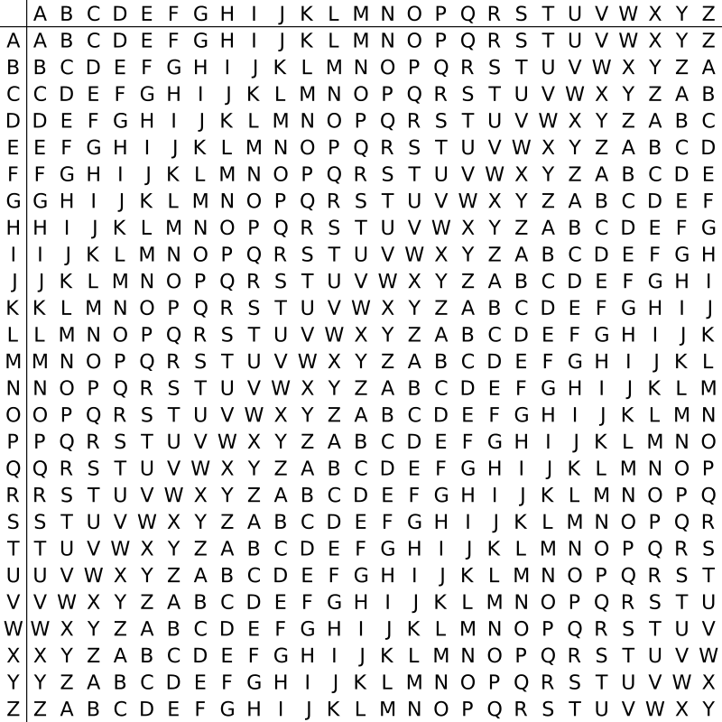

# 密码学概要

## 经典密码学介绍

经典密码学和现代密码学之间非常重要的一个区别是使用者的不同。

历史上，密码学的主要使用者是军事或者智囊机构，但是现在，密码学无处不在，依靠密码学的安全机制几乎是计算机系统的一个集成部件。用户在访问一个站点的时候（基本不会意识到）依靠了密码学。在多用户的操作系统中，密码学方法确保了访问控制，并阻止窃贼从丢失的笔记本中窃取商业机密。而在软件保护方法中使用了加密、认证和其他工具来阻止复制（一些公司的游戏就采用了这种方法来阻止未购买的用户使用）。

## 对称加密

该方式中，通信双方实现共享某种秘密信息，现在称为秘密密钥（private-key）或对称密钥（symmetric-key）。

当他们希望安全的通信时候，使用这个密钥，发送方使用这个密码**加密**或**混合**消息，接收方收到加密后的消息使用**相同**的密钥来**解密**或**去混合**来回复消息。

消息本身称为明文（plaintxt），从发送方传输到接收方的加密信息称为密文（ciphertext）。

在这一方式中，明文和密文的变化都使用了同一个密钥，所以这种加密方式称为**对称加密**。

### 凯撒密码（Caesar）

[凯撒加密](https://zh.wikipedia.org/wiki/%E5%87%B1%E6%92%92%E5%AF%86%E7%A2%BC)通过将明文中的字母往后移动三位形成密文这种方式加密，这种方法带来了一个问题就是：方法是固定的，因而学会这种加密方式的任何人都可以解密。

现代出现了一种凯撒密码的变种**ROT-13**，这种加密方法是通过往后移动13位来加密明文，广泛用于很多在线论坛，ROT-13仅仅用在保证文本的不可读，除非读者有意识的解密。

### 维吉尼亚加密（Vigenere）

[维吉尼亚加密](https://zh.wikipedia.org/wiki/%E7%BB%B4%E5%90%89%E5%B0%BC%E4%BA%9A%E5%AF%86%E7%A0%81)通过依次使用多个移位加密。

假设明文为：

> **ATTACKATDAWN**

选择某一关键词并重复而得到密钥，如关键词为LEMON时，密钥为：

> **LEMONLEMONLE**

对于明文的第一个字母A，对应密钥的第一个字母L，于是使用表格中L行字母表进行加密，得到密文第一个字母L。类似地，明文第二个字母为T，在表格中使用对应的E行进行加密，得到密文第二个字母X。以此类推，可以得到：

明文：

> **ATTACKATDAWN**

密钥：

> **LEMONLEMONLE**

密文：

> **LXFOPVEFRNHR**

解密的过程则与加密相反。

## 完善保密加密

上面我们介绍了古典加密方案，这些方案现在都可以用极少的计算量去破解。现在我们假设存在一个具有无穷大算力的攻击者，研究一种可抵抗无穷大算力攻击者的加密方案，这种方案就称为完善保密加密。

### 一次一密（Verman）加密

1917年，Verman创造了一种完善保密加密的加密方法，现在称为一次一密（one-time pad)，然而当时并没有证明其是完善保密加密。

直到大约25年后，香农（Shannon）提出了完善保密加密的概念，并且证明了一次一密能达到这一水平。

简单来说，一次一密就是对每一条的明文，都使用一个与之对应的密钥来加密，形成一个独一无二的密文，即使前后两个明文的内容相同，但是加密之后的密文也会不相同。

当攻击者获得密文和密钥之后，无法确定需要解密的密文的使用的是哪个密钥。

## 非对称（公钥）加密

### 素数、大数分解和RSA

给定一个合数N，**大数分解**的目的就是找到正整数p，q满足pq = N。

[RSA加密算法](https://zh.wikipedia.org/wiki/RSA%E5%8A%A0%E5%AF%86%E6%BC%94%E7%AE%97%E6%B3%95)是一种非对称加密算法，在公开密钥加密和电子商业中被广泛使用。RSA是1977年由罗纳德·李维斯特（Ron Rivest）、阿迪·萨莫尔（Adi Shamir）和伦纳德·阿德曼（Leonard Adleman）一起提出的。

当时他们三人都在麻省理工学院工作。RSA就是他们三人姓氏开头字母拼在一起组成的。

1973年，在英国政府通讯总部工作的数学家克利福德·柯克斯（Clifford Cocks）在一个内部文件中提出了一个与之等效的算法，但该算法被列入机密，直到1997年才得到公开。

对极大整数做因数分解的难度决定了RSA算法的可靠性。换言之，对一极大整数做因数分解愈困难，RSA算法愈可靠。假如有人找到一种快速因数分解的算法的话，那么用RSA加密的信息的可靠性就会极度下降。但找到这样的算法的可能性是非常小的。今天只有短的RSA钥匙才可能被强力方式破解。到当前为止，世界上还没有任何可靠的攻击RSA算法的方式。只要其钥匙的长度足够长，用RSA加密的信息实际上是不能被破解的。 

如何使用RSA的具体细节可以参考密码学相关教程或者Wikipedia的介绍，这里不再赘述。

好，到这里您应该对密码学的研究领域和范围有了一个大概清晰的印象，《密码学》在信息安全类专业中是属于单独的一门课程，这里我们只是抛砖引玉略微介绍了一些基本概念和知识，如对密码学感兴趣的同学可以参考《现代密码学 原理与协议》此书。
