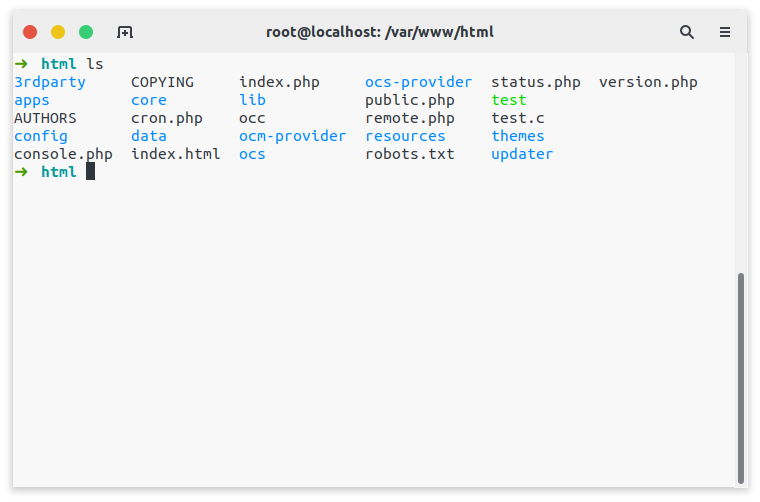
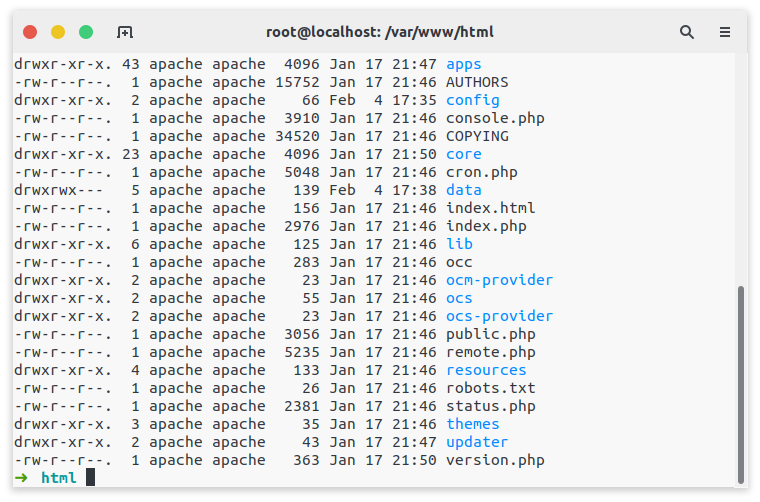
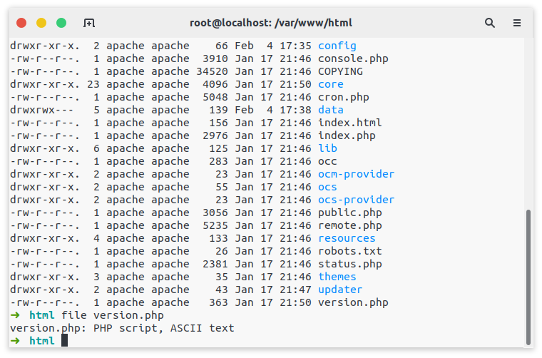
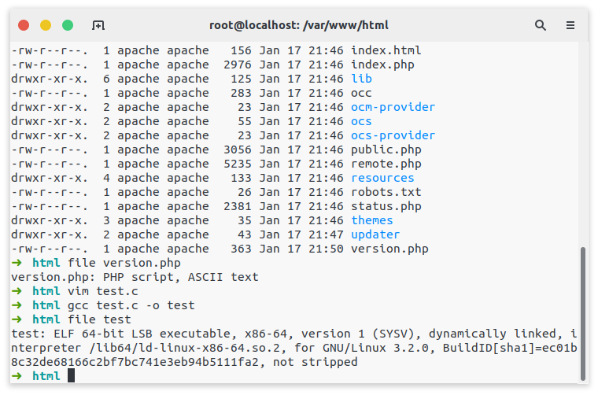
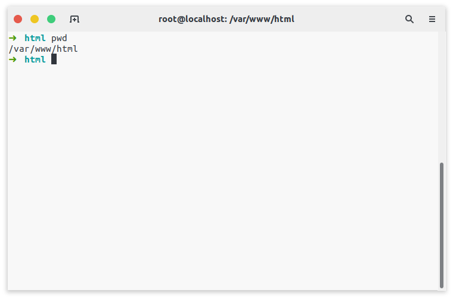
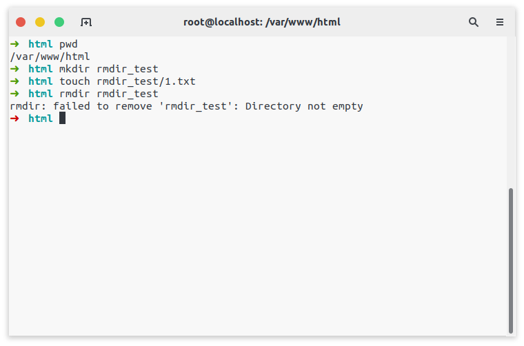
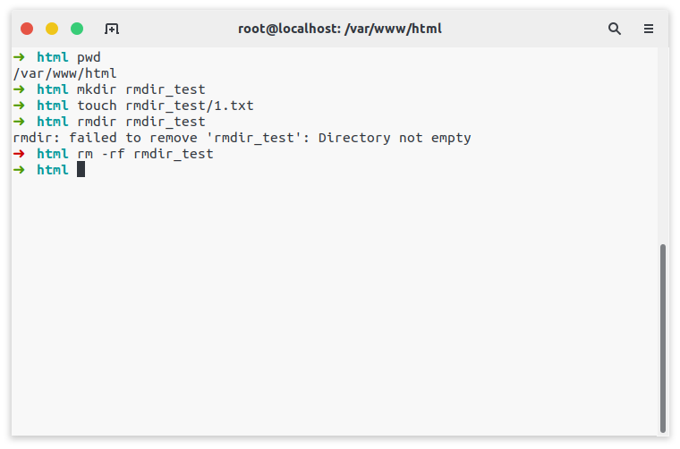

# Linux系统基础

## 历史

[UNIX](https://zh.wikipedia.org/zh-hans/UNIX)操作系统，是美国AT&T公司贝尔实验室于1969年完成的操作系统。最早由肯·汤普逊（Ken Thompson），丹尼斯·里奇（Dennis Ritchie），道格拉斯·麦克罗伊（Douglas McIlroy），和乔伊·欧桑纳于1969年在AT&T贝尔实验室开发。于1971年首次发布，最初是完全用汇编语言编写。后来，在1973年用一个重要的开拓性的方法，Unix被丹尼斯·里奇用编程语言C（内核和I/O例外）重新编写。高级语言编写的操作系统具有更佳的兼容性，能更容易地移植到不同的计算机平台。

1983年，理查德·马修·斯托曼创立GNU计划。这个计划有一个目标，是为了发展一个完全自由的类Unix操作系统。自1984年发起这个计划以来，在1985年，理查德·马修·斯托曼发起自由软件基金会并且在1989年撰写GPL。1990年代早期，GNU开始大量地产生或收集各种系统所必备的组件，像是——库、编译器、调试工具、文本编辑器，以及一个Unix的用户界面（Unix shell）。

但是像一些底层环境，如硬件驱动、守护进程、系统内核（kernel）仍然不完整和陷于停顿，GNU计划中是在Mach微内核的架构之上开发系统内核，也就是所谓的GNU Hurd，但是这个基于Mach的设计异常复杂，发展进度则相对缓慢。

林纳斯·托瓦兹曾说过如果GNU内核在1991年时可以用，他不会自己去写一个。而此时的386BSD涉及的法律问题直到1992年还没有解决，NetBSD和FreeBSD是386BSD的后裔，早于Linux。林纳斯·托瓦兹曾说，当时如果有可用的386BSD，他也可能会编写Linux。

MINIX是一个轻量小型并采用微内核(Micro-Kernel)架构的类Unix操作系统，是安德鲁·斯图尔特·塔能鲍姆为在计算机科学用作教学而设计的。

1991年，林纳斯·托瓦兹在赫尔辛基大学上学时，对操作系统很好奇。他对MINIX只允许在教育上使用很不满（在当时MINIX不允许被用作任何商业使用），于是他便开始写他自己的操作系统，这就是后来的Linux内核。

林纳斯·托瓦兹开始在MINIX上开发Linux内核，为MINIX写的软件也可以在Linux内核上使用。后来使用GNU软件代替MINIX的软件，因为使用从GNU系统来的源代码可以自由使用，这对Linux的发展有益。使用GNU GPL协议的源代码可以被其他项目所使用，只要这些项目使用同样的协议发布。为了让Linux可以在商业上使用，林纳斯·托瓦兹决定更改他原来的协议（这个协议会限制商业使用），以GNU GPL协议来代替。之后许多开发者致力融合GNU元素到Linux中，做出一个有完整功能的、自由的操作系统。

## Linux系统的安装

这里推荐使用**VirtualBox**，支持在Windows、Linux和MacOS上安装。

从[官网](https://www.virtualbox.org/)下载VirtualBox之后，然后我们安装并打开软件。


点击**New**创建一个虚拟机。


之后输入虚拟机的名字，调整虚拟机的类型，之后点击**Next**。


之后调整虚拟机的内存大小，这里建议如果只是用作**Web测试服务器**或**靶机**如**centos**和**redhat**等等，可以调整为**1024MB**左右即可，若打算用作桌面如**ubuntu**和**kali**等发行版，可以稍微往上调整一点到**2048MB**或者**4096MB**。


之后我们选择默认选项创建新磁盘，如果你有旧的磁盘打算导入，这里可以选择第三个。


之后选择磁盘类型，这里我们保持VirtualBox的默认磁盘类型**VDI**就可以，**VMDK**为**VMware**的默认磁盘类型，不用担心未来导入**ESXI**或者**KVM**有困难，现在这几种磁盘格式是可以相互转换的，这里为了使用VirtualBox的最优性能，我们保持默认选择VDI。


这里我们保持默认，选择动态调整磁盘，动态调整磁盘中虚拟机使用了多少，物理机上就占用多少，虚拟机要新增空间的时候，VirtualBox才会分配空间，直到虚拟机的空间等于虚拟机最大可支配的空间。

这种模式的缺点就是虚拟机IO性能不高，但是优点就是占用空间小。

第二种模式，就是一次性分配完虚拟机的最大可支配容量，这种模式的缺点就是占用空间大，但是IO性能好。


之后就是设置一下虚拟机文件存放位置和磁盘容量。


然后我们的虚拟机就创建好了。之后就是安装操作系统。

我们选择刚刚创建的虚拟机并点击**Start**。


这时候会跳出这个窗口，这个窗口只会在虚拟机生命周期里面你的第一次点击Start才会出现。如果你误关闭了这个窗口，我们可以从设置那里挂载**.iso**文件上去，这步我们下面再说。


然后就是点击右侧小文件夹选择系统ISO文件

这里VirtualBox做了一个改变，以前的版本就会跳转到文件选择窗口，新版本的这里就多了一个磁盘选择器。


第一次安装的同学这里是不会有任何磁盘的，这时候我们点击**Add**添加一个磁盘。然后就选择你想要安装的操作系统的.iso文件。

之后就会回到刚刚那个界面，我们这时候选中刚刚添加的.iso文件，点击**Choose**，然后就是点击**Start**，VirtualBox就会开始按照系统了。


之后按照一般步骤去安装就完了。


如果安装步骤没跳出.iso文件选择界面，我们可以选中虚拟机，然后打开**Setting**。


选择**Storage**，就可以看到右边有个**Controller:IDE**的东西，然后我们点击Controller:IDE后面两个小按钮的第一个，就会跳出.iso文件选择窗口。


如果是桌面版的Linux，安装完成之后可以安装VritualBox的客户端增强工具，找到**Devices**之后，选择最后一个**Insert Guest Additions CD image...**。

这里做演示的是一台没有桌面环境的centos8，ubuntu和kali等操作系统可以类推。


然后我们挂载**cdrom**到**mnt**上，之后运行VirtualBox提供的程序就可安装。

```bash
mount /dev/cdrom /mnt
cd /mnt
./VBoxLinuxAdditions.run
```


不过一般来说，安装时候都会出现缺一个叫**kernel-headers**程序的错误，在ubuntu和kali中不叫这个名字。

在centos8中或者其他Linux系统中，我们先确认虚拟机运行的是**最新的内核**，因为源中的`kernel-devel`和`kernel-headers`只有最新内核的版本，这里我们用centos8举例，我们首先更新内核到最新版本，执行。

当然你也可以只更新内核，但是这里有个懒惰的方法，更新系统所有软件，不仅仅是内核。

```bash
dnf install epel-release
dnf update
```

之后安装必要的软件。

```bash
dnf install dkms kernel-devel kernel-headers gcc make bzip2 perl
```

升级完和安装玩之后，再运行VirtualBox提供的程序就可以了。

因为VirtualBox提供了和VMware类似的增强功能，如在物理机复制的内容可以粘贴到虚拟机里面，或者让虚拟机自适应物理机屏幕等等。

我们把这两个**Shared Clipboard**和**Drag and Drop**选到**Bidirectional**双向这个选项上。

之后重启虚拟机就可以了。


## Linux系统远程管理工具

目前，常用的远程管理协议有以下 4 种：

- RDP（remote desktop protocol）协议：远程桌面协议，大部分 Windows 系统都默认支持此协议，Windows 系统中的远程桌面管理就基于该协议。

- RFB（Remote FrameBuffer）协议：图形化远程管理协议，VNC 远程管理工具就基于此协议。

- Telnet：命令行界面远程管理协议，几乎所有的操作系统都默认支持此协议。此协议的特点是，在进行数据传送时使用明文传输的方式，也就是不对数据进行加密。

- SSH（Secure Shell）协议：命令行界面远程管理协议，几乎所有操作系统都默认支持此协议。和 Telnet 不同，该协议在数据传输时会对数据进行加密并压缩，因此使用此协议传输数据既安全速度又快。

现在微软的**Windows10**已经加入了**ssh**的支持，我们可以直接在**cmd**中或者**powershell**中直接运行ssh连接到Linux服务器。

## Linux的目录结构

FHS 认为，Linux 系统的根目录最为重要（没有之一），其原因有以下 2 点：

- 所有目录都是由根目录衍生出来的
- 根目录与系统的开机、修复、还原密切相关

因此，根目录必须包含开机软件、核心文件、开机所需程序、函数库、修复系统程序等文件。

| 一级目录 | 功能                                                                                                                                                                                                                                                                                                                               |
|----------|------------------------------------------------------------------------------------------------------------------------------------------------------------------------------------------------------------------------------------------------------------------------------------------------------------------------------------|
| /bin/    | 存放系统命令，普通用户和 root 都可以执行。放在 /bin 下的命令在单用户模式下也可以执行。                                                                                                                                                                                                                                             |
| /boot/   | 系统启动目录，保存与系统启动相关的文件，如内核文件和启动引导程序（grub）文件等。                                                                                                                                                                                                                                                   |
| /dev/    | 设备文件保存位置。                                                                                                                                                                                                                                                                                                                 |
| /etc/    | 配置文件保存位置。系统内所有采用默认安装方式（rpm 安装）的服务配置文件全部保存在此目录中，如用户信息、服务的启动脚本、常用服务的配置文件等。                                                                                                                                                                                       |
| /home/   | 普通用户的主目录（也称为家目录）。在创建用户时，每个用户要有一个默认登录和保存自己数据的位置，就是用户的主目录，所有普通用户的主目录是在 /home/ 下建立一个和用户名相同的目录。如用户 liming 的主目录就是 /home/liming。                                                                                                            |
| /lib/    | 系统调用的函数库保存位置。                                                                                                                                                                                                                                                                                                         |
| /media/  | 挂载目录。系统建议用来挂载媒体设备，如软盘和光盘。                                                                                                                                                                                                                                                                                 |
| /mnt/    | 挂载目录。早期 Linux 中只有这一个挂载目录，并没有细分。系统建议这个目录用来挂载额外的设备，如 U 盘、移动硬盘和其他操作系统的分区。                                                                                                                                                                                                 |
| /misc/   | 挂载目录。系统建议用来挂载 NFS 服务的共享目录。虽然系统准备了三个默认挂载目录 /media/、/mnt/、/misc/，但是到底在哪个目录中挂载什么设备可以由管理员自己决定。例如，笔者在接触 Linux 的时候，默认挂载目录只有 /mnt/，所以养成了在 /mnt/ 下建立不同目录挂载不同设备的习惯，如 /mnt/cdrom/ 挂载光盘、/mnt/usb/ 挂载 U 盘，都是可以的。 |
| /opt/    | 第三方安装的软件保存位置。这个目录是放置和安装其他软件的位置，手工安装的源码包软件都可以安装到这个目录中。不过笔者还是习惯把软件放到 /usr/local/ 目录中，也就是说，/usr/local/ 目录也可以用来安装软件。                                                                                                                            |
| /root/   | root 的主目录。普通用户主目录在 /home/ 下，root 主目录直接在“/”下。                                                                                                                                                                                                                                                                |
| /sbin/   | 保存与系统环境设置相关的命令，只有 root 可以使用这些命令进行系统环境设置，但也有些命令可以允许普通用户查看。                                                                                                                                                                                                                       |
| /srv/    | 服务数据目录。一些系统服务启动之后，可以在这个目录中保存所需要的数据。                                                                                                                                                                                                                                                             |
| /tmp/    | 临时目录。系统存放临时文件的目录，在该目录下，所有用户都可以访问和写入。建议此目录中不能保存重要数据，最好每次开机都把该目录清空。                                                                                                                                                                                                 |

但除此之外，Linux 系统根目录下通常还包含以下几个一级目录。

| 一级目录     | 功能                                                                                                                                                                                                                                                                       |
|--------------|----------------------------------------------------------------------------------------------------------------------------------------------------------------------------------------------------------------------------------------------------------------------------|
| /lost+found/ | 当系统意外崩溃或意外关机时，产生的一些文件碎片会存放在这里。在系统启动的过程中，fsck 工具会检查这里，并修复已经损坏的文件系统。这个目录只在每个分区中出现，例如，/lost+found 就是根分区的备份恢复目录，/boot/lost+found 就是 /boot 分区的备份恢复目录。                    |
| /proc/       | 虚拟文件系统。该目录中的数据并不保存在硬盘上，而是保存到内存中。主要保存系统的内核、进程、外部设备状态和网络状态等。如 /proc/cpuinfo 是保存 CPU 信息的，/proc/devices 是保存设备驱动的列表的，/proc/filesystems 是保存文件系统列表的，/proc/net 是保存网络协议信息的等等。 |
| /sys/        | 虚拟文件系统。和 /proc/ 目录相似，该目录中的数据都保存在内存中，主要保存与内核相关的信息                                                                                                                                                                                   |

## Linux系统的基本使用

### Linux Shell

当我们安装好系统，然后登录系统，马上出现的就是这个东西。

```bash
[root@localhost ~]#
```

这就是Shell，它是用户使用Linux系统的桥梁，负责将用户的指令翻译之后传递给操作系统的内核。Shell可以是一种命令语言，也可以是一种编程语言（专门有书讲Shell编程）。

它虽然不是系统内核的一部分，但是它调用系统内核的功能为用户服务，如创建文件，重启网卡，运行程序等等。对于使用Linux系统的人来说，Shell是最重要的一个程序，即使你的操作系统同时还具有桌面环境，所以深入了解Shell的操作，是使用Linux系统的关键。

那么，这个东西的含义到底是什么？

| 符号 | 意义 |
|-----|------|
| [] | 这是提示符的分隔符号，没有特殊含义。 |
| root | 显示的是当前的登录用户，笔者现在使用的是 root 用户登录。 |
| @ | 分隔符号，没有特殊含义。 |
| localhost | 当前系统的简写主机名（完整主机名是 localhost.localdomain）。 |
| ~ | 代表用户当前所在的目录，此例中用户当前所在的目录是家目录。 |
| # | 命令提示符，Linux 用这个符号标识登录的用户权限等级。如果是超级用户，提示符就是 #；如果是普通用户，提示符就是 $。 |

Linux上常见的Shell有**bash**，**sh**，**ash**，**csh**，**ksh**，**zsh**等等。

#### bash

bash是linux标准默认的Shell，bash由**Brian Fox**和**Chet Ramey**共同完，是BourneAgain Shell的缩写，内部命令一共有40个。

#### sh

sh由Steve Bourne开发，是Bourne Shell的缩写，sh是Unix标准默认的shell。

#### ash

ash是由Kenneth Almquist编写的，是Linux系统中占用系统资源最少的一种Shell，它只包含24个内部命令，因而使用起来很不方便。

#### csh

csh是Linux系统中比较大的一种Shell，它由William Joy为代表的总共47位作者编成，共有52个內部命令。此shell其实是指向`/bin/tcsh`这个Shell，也就是說，csh其实和tcsh一样。

#### ksh

ksh是Korn Shell的缩写，由Eric Gisin编写，共有42个內部命令。此Shell最大的优点是几乎和商业版的ksh完全兼容，这样就可以不用花钱购买商业版本的情況下使用商业版本的性能了。

#### zsh

Z Shell是在对Bourne shell做出了大量改进，同时加入了Bash、ksh及tcsh的某些功能上完成的Shell。Paul Falstad于1990年在普林斯顿大学求学时编写了Zsh的初版。名称zsh源于耶鲁大学教授邵中（Zhong Shao，后转为普林斯顿大学教授），保罗将教授的用户名"zsh"作为此Shell的名称。

目前来说，zsh是比较流行的一种Shell，下面的课程我们将会在zsh中完成截图和操作。

### 命令的基本格式

接下来看看 Linux 命令的基本格式。

```bash
[root@localhost ~]# 命令[选项][参数]
```

命令格式中的`[]`代表可选项，也就是有些命令可以不写选项或参数，也能执行。

那么，我们就用Linux系统中最常见的`ls`命令来解释一下命令的格式。如果按照命令的分类，那么`ls`命令应该属于目录操作命令。

```bash
ls
```



`ls`命令之后不加选项和参数也能执行，不过只能执行最基本的功能，即显示当前目录下的文件名。那么加入一个选项，会出现什么结果？

```bash
ls -l
```



如果加一个`-l`选项，则显示的内容明显增多了。

`-l`是长格式（long list）的意思，也就是显示文件的详细信息。

命令中的选项又分为**短格式选项**（-l）和**长格式选项**（--all）。短格式选项是英文的简写，用一个减号调用，例如。

```bash
ls -l
```

而长格式选项是英文完整单词，一般用两个减号调用，例如。

```bash
ls --all
```

一般情况下，短格式选项是长格式选项的缩写，也就是一个短格式选项会有对应的长格式选项。当然也有例外，比如`ls`命令的短格式选项`-l`就没有对应的长格式选项。所以具体的命令选项可以通过后面我们要学习的帮助命令来进行査询。

而命令中了一个重要的概念就是参数，参数是命令的操作对象，一般文件、目录、用户和进程等可以作为参数被命令操作。

```bash
ls -l version.php
```

但是为什么一开始`ls`命令可以省略参数？那是因为有默认参数。命令一般都需要加入参数，用于指定命令操作的对象是谁。如果可以省略参数，则一般都有默认参数。

### 识别文件类型

对于第一次使用Linux系统**Shell**的用户，如何知道哪个是文件，哪个是目录？

Linux Shell中一般默认用不同的颜色来区分不同种类的文件，例如**绿色**代表可执行文件，**红色**代表压缩文件，**浅绿色**代表链接文件，**白色**代表其他文件，**黄色**代表设备文件等等。

但是，不同颜色所代表的文件类型不一定是这样，更准确的对应方式还取决于配置文件`/etc/DIR_COLORS`中的规定。因此，如果想详细了解不同文件类型所对应的颜色，可以使用 man 命令。

```bash
man dir_colors
```

> 注意，有些Linux发行版单独使用ls命令，无法显示出带有不同颜色的文件和目录，此时就需要使用`ls --color=auto`命令，明确令其使用颜色来区分文件类型。

如果不想每次使用`ls`命令时，都显式的附带`--color=auto`，可以执行如下命令。

```bash
alias ls = 'ls --color=auto'
```

通过设置一个别名，这样当后续使用`ls`命令时，就等同于执行`ls --color=auto`命令了。

同时，如果想使这个设置永远生效，还需要将其添加到`/etc/bashrc`或`/home/username/.bashrc`文件中，前者对所有用户有效，而后者仅对用户`username`有效。

Linux Shell中除了上面那种方法，还可以通过文件本身所具有的**属性**精确判断文件类型。

通过`ls -l`命令，我们就可以查看当前目录下所有文件和目录各自的属性。


如图所示，途中每行代表一个文件或目录，其中第一个字符表示的就是文件的类型，其中**d**代表目录（directory）。后面的**r**代表可读， **w**代表可写，**x**代表可执行。

第一个字幕的可能取值以及表示的文件类型，如下表所示。

| 第一个字符 | 文件类型 |
|----------|---------|
| - | 普通文件，包括纯文本文件、二进制文件、各种压缩文件等。 |
| d | 目录，类似 Windows 系统中的文件夹。 |
| b | 块设备文件，就是保存大块数据的设备，比如最常见的硬盘。 |
| c | 字符设备文件，例如键盘、鼠标等。 |
| s | 套接字文件，通常用在网络数据连接，可以启动一个程序开监听用户的要求，用户可以通过套接字进行数据通信。 |
| p | 管道文件，其主要作用是解决多个程序同时存取一个文件所造成的错误。 |
| l | 链接文件，类似 Windows 系统中的快捷方式。 |

除以上两种方法外，Linux Shell还提供了`file`命令，可以查询文件的类型。此命令可以识别出文件的类型和编码格式，这是其他命令所做不到的。

使用不带任何选项的`file`命令，即可查看指定文件的类型信息。下面的例子中可以看出**version.php**的文件类型为 **PHP script**，编码格式为**ASCII**。

```bash
file version.php
```

输出

```bash
version.php: PHP script, ASCII text
```



为了做演示，这里我们用C语言生成了一个简单的二进制可执行文件，同样用`file`命令查看。



关于`file`命令的很多用法这里就不再赘述，感兴趣的同学可以参考man手册。

```bash
man file
```

### 切换目录

在使用Linux系统的时候，我们经常会要到某个目录中去查看有哪些文件或者运行文件，在Windows中可以使用**Windows资源管理器**来完成这一步操作，但是在Linux系统中无桌面环境的情况下，我们可以使用`cd`命令。

`cd`是Change Directory的缩写，用来切换工作目录。

Linux命令按照来源方式，可分为两种，分别是Shell**内置命令**和**外部命令**。

所谓Shell内置命令，就是 Shell 自带的命令，这些命令是没有执行文件的。

而外部命令就是由程序员单独开发的，所以会有命令的执行文件。Linux系统中的绝大多数命令是外部命令，而`cd`命令是一个典型的内置命令。

`cd`命令的基本格式。

```bash
cd [相对路径或绝对路径]
```

除此之外，`cd`命令后面可以跟一些特殊符号，表达固定的含义，如下表所示。

| 特殊符号 | 作 用 |
|---------|------|
| ~ | 代表当前登录用户的主目录。 |
| ~username | 表示切换至指定用户的主目录。 |
| - | 代表上次所在目录。|
| . | 代表当前目录。 |
| .. | 代表上级目录。 |

### 显示当前路径

很多Linux的初学者第一次进入Linux系统的时候，都搞不清楚自己现在目前所在的位置。

`pwd`命令，是Print Working Directory（打印工作目录）的缩写，功能是显示用户当前所处的工作目录。该命令的基本格式为。

```bash
pwd
```



### 创建目录

有时候我们用户目录下面放了太多的各种文件，这时候我们可以使用创建目录的目录，然后把这些暂时用不到的文件移到这个目录下。

`mkdir命令，是make directories的缩写，用于创建新目录，此命令所有用户都可以使用。

`mkdir`命令的基本格式为：

```bash
mkdir [-mp] 目录名
```

| 参数 | 意义 |
|-----|------|
| -m | 选项用于手动配置所创建目录的权限，而不再使用默认权限。 |
| -p | 选项递归创建所有目录，以创建`/home/test/demo`为例，在默认情况下，你需要一层一层的创建各个目录，而使用 -p 选项，则系统会自动帮你创建`/home`，`/home/test`以及`/home/test/demo`。 |

### 删除目录和文件

和`mkdir`命令恰好相反，`rmdir`（remove empty directories的缩写）命令用于删除空目录，此命令的基本格式为。

```bash
rmdir [-p] 目录名
```

其中，`-p`选项用于递归删除空目录。

命令后面加目录名称即可，但命令执行成功与否，取决于要删除目录是否是空目录，因为 rmdir 命令只能删除空目录。

所以`rmdir`命令的作用十分有限，因为只能刪除空目录，所以一旦目录中有内容，就会报错。



这个命令其实并不常用，正常情况下我们会使用`rm`命令，使用此命令不但可以删除目录，还可以删除文件。

```bash
rm -rf rmdir_test
```



`rm`是强大的删除命令，它可以永久性地删除文件系统中指定的文件或目录。在使用`rm`命令删除文件或目录时，系统不会产生任何提示信息。此命令的基本格式。

```bash
rm[选项] 文件或目录
```

| 选项 | 意义 |
|-----|------|
| -f | 强制删除（force），和`-i`选项相反，使用`-f`，系统将不再询问，而是直接删除目标文件或目录。 |
| -i | 和`-f`正好相反，在删除文件或目录之前，系统会给出提示信息，使用`-i`可以有效防止不小心删除有用的文件或目录。 |
| -r | 递归删除，主要用于删除目录，可删除指定目录及包含的所有内容，包括所有的子目录和文件。 |

其中初学者要注意的是，`rm`命令是一个具有破坏性的命令，因为`rm`命令会永久性地删除文件或目录，这就意味着，如果没有对文件或目录进行备份，一旦使用`rm`命令将其删除，将无法恢复，因此，尤其在使用`rm`命令删除目录时，要慎之又慎。

好，到这里，你应该对一些操作Linux系统的命令有了自己初步的体会了，我们这里挑选的只是最基本几个命令，在使用Linux系统的过程中，希望各位同学善于思考，勤于练习，遇到不会的操作时候，主动利用**Google**等搜索引擎查询使用方法，英语基础好一些的同学可以使用`man`命令查询用法，然后在这个过程中不断记忆和重复，最终达到操作Linux如行云流水一样。
