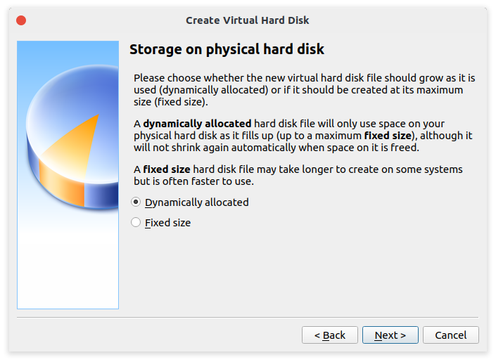

# Linux系统基础

## 历史

UNIX操作系统，是美国AT&T公司贝尔实验室于1969年完成的操作系统。最早由肯·汤普逊（Ken Thompson），丹尼斯·里奇（Dennis Ritchie），道格拉斯·麦克罗伊（Douglas McIlroy），和乔伊·欧桑纳于1969年在AT&T贝尔实验室开发。于1971年首次发布，最初是完全用汇编语言编写。后来，在1973年用一个重要的开拓性的方法，Unix被丹尼斯·里奇用编程语言C（内核和I/O例外）重新编写。高级语言编写的操作系统具有更佳的兼容性，能更容易地移植到不同的计算机平台。

1983年，理查德·马修·斯托曼创立GNU计划。这个计划有一个目标，是为了发展一个完全自由的类Unix操作系统。自1984年发起这个计划以来，在1985年，理查德·马修·斯托曼发起自由软件基金会并且在1989年撰写GPL。1990年代早期，GNU开始大量地产生或收集各种系统所必备的组件，像是——库、编译器、调试工具、文本编辑器，以及一个Unix的用户界面（Unix shell）。

但是像一些底层环境，如硬件驱动、守护进程、系统内核（kernel）仍然不完整和陷于停顿，GNU计划中是在Mach微内核的架构之上开发系统内核，也就是所谓的GNU Hurd，但是这个基于Mach的设计异常复杂，发展进度则相对缓慢。

林纳斯·托瓦兹曾说过如果GNU内核在1991年时可以用，他不会自己去写一个。而此时的386BSD涉及的法律问题直到1992年还没有解决，NetBSD和FreeBSD是386BSD的后裔，早于Linux。林纳斯·托瓦兹曾说，当时如果有可用的386BSD，他也可能会编写Linux。

MINIX是一个轻量小型并采用微内核(Micro-Kernel)架构的类Unix操作系统，是安德鲁·斯图尔特·塔能鲍姆为在计算机科学用作教学而设计的。

1991年，林纳斯·托瓦兹在赫尔辛基大学上学时，对操作系统很好奇。他对MINIX只允许在教育上使用很不满（在当时MINIX不允许被用作任何商业使用），于是他便开始写他自己的操作系统，这就是后来的Linux内核。

林纳斯·托瓦兹开始在MINIX上开发Linux内核，为MINIX写的软件也可以在Linux内核上使用。后来使用GNU软件代替MINIX的软件，因为使用从GNU系统来的源代码可以自由使用，这对Linux的发展有益。使用GNU GPL协议的源代码可以被其他项目所使用，只要这些项目使用同样的协议发布。为了让Linux可以在商业上使用，林纳斯·托瓦兹决定更改他原来的协议（这个协议会限制商业使用），以GNU GPL协议来代替。之后许多开发者致力融合GNU元素到Linux中，做出一个有完整功能的、自由的操作系统。

## Linux系统的安装

这里推荐使用**VirtualBox**这个虚拟化软件，支持在Windows，Linux和MacOS上安装。

从[官网](https://www.virtualbox.org/)下载VirtualBox之后，然后我们安装并打开软件。


点击**New**创建一个虚拟机。


之后输入虚拟机的名字，调整虚拟机的类型，之后点击**Next**。


之后调整虚拟机的内存大小，这里建议如果只是用作**Web测试服务器**或**靶机**如**centos**和**redhat**等等，可以调整为**1024MB**左右即可，若打算用作桌面如**ubuntu**和**kali**等发行版，可以稍微往上调整一点到**2048MB**或者**4096MB**。


之后我们选择默认选项创建新磁盘，如果你有旧的磁盘打算导入，这里可以选择第三个。


之后选择磁盘类型，这里我们保持VirtualBox的默认磁盘类型**VDI**就可以，**VMDK**为**VMware**的默认磁盘类型，不用担心未来导入**ESXI**或者**KVM**有困难，现在这几种磁盘格式是可以相互转换的，这里为了使用VirtualBox的最优性能，我们保持默认选择VDI。


这里我们保持默认，选择动态调整磁盘，动态调整磁盘中虚拟机使用了多少，物理机上就占用多少，虚拟机要新增空间的时候，VirtualBox才会分配空间，直到虚拟机的空间等于虚拟机最大可支配的空间。

这种模式的缺点就是虚拟机IO性能不高，但是优点就是占用空间小。

第二种模式，就是一次性分配完虚拟机的最大可支配容量，这种模式的缺点就是占用空间大，但是IO性能好。



之后就是设置一下虚拟机文件存放位置和磁盘容量。


然后我们的虚拟机就创建好了。之后就是安装操作系统。

我们选择刚刚创建的虚拟机并点击**Start**。


这时候会跳出这个窗口，这个窗口只会在虚拟机生命周期里面你的第一次点击Start才会出现。如果你误关闭了这个窗口，我们可以从设置那里挂载**.iso**文件上去，这步我们下面再说。


然后就是点击右侧小文件夹选择系统ISO文件

这里VirtualBox做了一个改变，以前的版本就会跳转到文件选择窗口，新版本的这里就多了一个磁盘选择器。


第一次安装的同学这里是不会有任何磁盘的，这时候我们点击**Add**添加一个磁盘。然后就选择你想要安装的操作系统的.iso文件。

之后就会回到刚刚那个界面，我们这时候选中刚刚添加的.iso文件，点击**Choose**，然后就是点击**Start**，VirtualBox就会开始按照系统了。


之后按照一般步骤去安装就完了。


如果安装步骤没跳出.iso文件选择界面，我们可以选中虚拟机，然后打开**Setting**。


选择**Storage**，就可以看到右边有个**Controller:IDE**的东西，然后我们点击Controller:IDE后面两个小按钮的第一个，就会跳出.iso文件选择窗口。


如果是桌面版的Linux，安装完成之后可以安装VritualBox的客户端增强工具，找到**Devices**之后，选择最后一个**Insert Guest Additions CD image...**。

这里做演示的是一台没有桌面环境的centos8，ubuntu和kali等操作系统可以类推。


然后我们挂载**cdrom**到**mnt**上，之后运行VirtualBox提供的程序就可安装。

```bash
mount /dev/cdrom /mnt
cd /mnt
./VBoxLinuxAdditions.run
```


不过一般来说，安装时候都会出现缺一个叫**kernel-headers**程序的错误，在ubuntu和kali中不叫这个名字。

在centos8中或者其他Linux系统中，我们先确认虚拟机运行的是**最新的内核**，因为源中的`kernel-devel`和`kernel-headers`只有最新内核的版本，这里我们用centos8举例，我们首先更新内核到最新版本，执行。

当然你也可以只更新内核，但是这里有个懒惰的方法，更新系统所有软件，不仅仅是内核。

```bash
dnf install epel-release
dnf update
```

之后安装必要的软件。

```bash
dnf install dkms kernel-devel kernel-headers gcc make bzip2 perl
```

升级完和安装玩之后，再运行VirtualBox提供的程序就可以了。

因为VirtualBox提供了和VMware类似的一些增强功能，如在物理机复制的内容可以粘贴到虚拟机里面，或者让虚拟机自适应你的屏幕等等。

我们把这两个**Shared Clipboard**和**Drag and Drop**选到**Bidirectional**双向这个选项上。

之后重启虚拟机就可以了。


## Linux系统远程管理工具

目前，常用的远程管理协议有以下 4 种：

- RDP（remote desktop protocol）协议：远程桌面协议，大部分 Windows 系统都默认支持此协议，Windows 系统中的远程桌面管理就基于该协议。

- RFB（Remote FrameBuffer）协议：图形化远程管理协议，VNC 远程管理工具就基于此协议。

- Telnet：命令行界面远程管理协议，几乎所有的操作系统都默认支持此协议。此协议的特点是，在进行数据传送时使用明文传输的方式，也就是不对数据进行加密。

- SSH（Secure Shell）协议：命令行界面远程管理协议，几乎所有操作系统都默认支持此协议。和 Telnet 不同，该协议在数据传输时会对数据进行加密并压缩，因此使用此协议传输数据既安全速度又快。

现在微软的**Windows10**已经加入了**ssh**的支持，我们可以直接在**cmd**中或者**powershell**中直接ssh连接Linux服务器。

## Linux的目录结构

FHS 认为，Linux 系统的根目录最为重要（没有之一），其原因有以下 2 点：

- 所有目录都是由根目录衍生出来的
- 根目录与系统的开机、修复、还原密切相关

因此，根目录必须包含开机软件、核心文件、开机所需程序、函数库、修复系统程序等文件。

| 一级目录 | 功能 |
|---------|-----|
| /bin/ | 存放系统命令，普通用户和 root 都可以执行。放在 /bin 下的命令在单用户模式下也可以执行。 |
| /boot/ | 系统启动目录，保存与系统启动相关的文件，如内核文件和启动引导程序（grub）文件等。 |
| /dev/ | 设备文件保存位置。 |
| /etc/ | 配置文件保存位置。系统内所有采用默认安装方式（rpm 安装）的服务配置文件全部保存在此目录中，如用户信息、服务的启动脚本、常用服务的配置文件等。 |
| /home/ | 普通用户的主目录（也称为家目录）。在创建用户时，每个用户要有一个默认登录和保存自己数据的位置，就是用户的主目录，所有普通用户的主目录是在 /home/ 下建立一个和用户名相同的目录。如用户 liming 的主目录就是 /home/liming。 |
| /lib/ | 系统调用的函数库保存位置。 |
| /media/ | 挂载目录。系统建议用来挂载媒体设备，如软盘和光盘。 |
| /mnt/ | 挂载目录。早期 Linux 中只有这一个挂载目录，并没有细分。系统建议这个目录用来挂载额外的设备，如 U 盘、移动硬盘和其他操作系统的分区。 |
| /misc/ | 挂载目录。系统建议用来挂载 NFS 服务的共享目录。虽然系统准备了三个默认挂载目录 /media/、/mnt/、/misc/，但是到底在哪个目录中挂载什么设备可以由管理员自己决定。例如，笔者在接触 Linux 的时候，默认挂载目录只有 /mnt/，所以养成了在 /mnt/ 下建立不同目录挂载不同设备的习惯，如 /mnt/cdrom/ 挂载光盘、/mnt/usb/ 挂载 U 盘，都是可以的。 |
| /opt/ | 第三方安装的软件保存位置。这个目录是放置和安装其他软件的位置，手工安装的源码包软件都可以安装到这个目录中。不过笔者还是习惯把软件放到 /usr/local/ 目录中，也就是说，/usr/local/ 目录也可以用来安装软件。 |
| /root/ | root 的主目录。普通用户主目录在 /home/ 下，root 主目录直接在“/”下。 |
| /sbin/ | 保存与系统环境设置相关的命令，只有 root 可以使用这些命令进行系统环境设置，但也有些命令可以允许普通用户查看。 |
| /srv/ | 服务数据目录。一些系统服务启动之后，可以在这个目录中保存所需要的数据。 |
| /tmp/ | 临时目录。系统存放临时文件的目录，在该目录下，所有用户都可以访问和写入。建议此目录中不能保存重要数据，最好每次开机都把该目录清空。 |

但除此之外，Linux 系统根目录下通常还包含以下几个一级目录。

| 一级目录 | 功能 |
|---------|-----|
| /lost+found/ | 当系统意外崩溃或意外关机时，产生的一些文件碎片会存放在这里。在系统启动的过程中，fsck 工具会检查这里，并修复已经损坏的文件系统。这个目录只在每个分区中出现，例如，/lost+found 就是根分区的备份恢复目录，/boot/lost+found 就是 /boot 分区的备份恢复目录。 |
| /proc/ | 虚拟文件系统。该目录中的数据并不保存在硬盘上，而是保存到内存中。主要保存系统的内核、进程、外部设备状态和网络状态等。如 /proc/cpuinfo 是保存 CPU 信息的，/proc/devices 是保存设备驱动的列表的，/proc/filesystems 是保存文件系统列表的，/proc/net 是保存网络协议信息的等等。 |
| /sys/ | 虚拟文件系统。和 /proc/ 目录相似，该目录中的数据都保存在内存中，主要保存与内核相关的信息 |

## 未完待续
